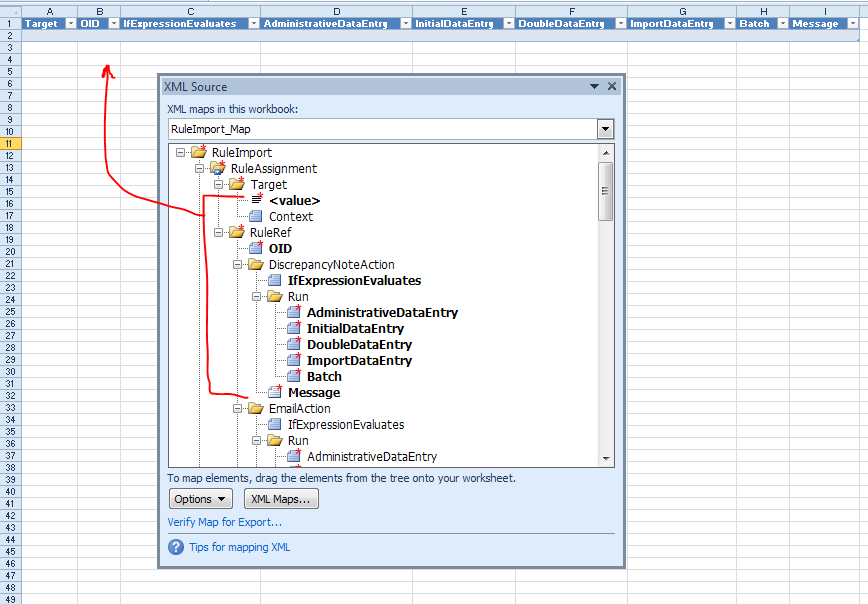
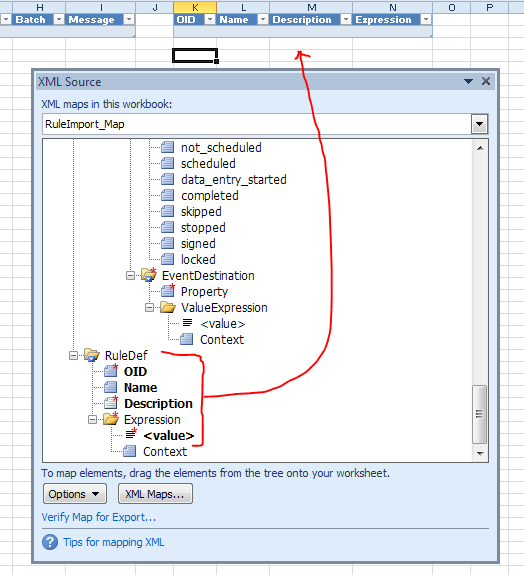

# Working with Rule XML in Excel

## Contents
- [Introduction](#introduction)
    - [Conversions](#conversions)
- [Instructions](#instructions)
    - [Preparing a New Spreadsheet](#preparing-a-new-spreadsheet)
    - [Writing Rules](#writing-rules)
    - [Performing XML Conversions](#performing-xml-conversions)


# Introduction
As an alternative to editing rule XML or using the Rule Designer app, rules can be worked with in Excel.

- Advantages:
    - Rule definitions can be easily seen all at once
    - Preparation of UAT documents can be done by copy/paste of relevant columns
- Disadvantages:
    - Only compatible with DiscrepancyNote rules; other actions have complex structures that don't map into a tabular format very well
    - Some pre/post processing required before upload to OpenClinica, or reading from an OpenClinica rule export


## Conversions
The difference between the rule XML layout that OpenClinica consumes and produces, and what Excel consumes and produces, is the structure of the RuleAssignment elements.

In Excel, the following layout is required. There are separate RuleAssignments for each RuleRef, even if the Target is the same.

```
- RuleAssignment, Target 1
    - RuleRef
- RuleAssignment, Target 1
    - RuleRef
- RuleAssignment, Target 2
    - RuleRef
- ...more rule assignments...
- RuleDef
- RuleDef
- ...more rule definitions...
```

In OpenClinica, the following layout is required. RuleRefs for the same Target are grouped together in a RuleAssignment.

```
- RuleAssignment, Target 1
    - RuleRef
    - RuleRef
- RuleAssignment, Target 2
    - RuleRef
- ...more rule assignments...
- RuleDef
- RuleDef
- ...more rule definitions...
```

The XSLT script "collateOrSplitRuleRefsByTarget.xsl" can perform the conversion from the OpenClinica to the Excel layout, and from Excel to the OpenClinica layout. Examples of each of the above layouts are in the files "rule_xml_excel.xml" and "rule_xml_openclinica.xml".


[Back to Contents](#contents)


# Instructions


## Preparing a New Spreadsheet
There is a template XLSX file available for use. If for some reason this needs to be re-created, it can be done as follows:

- Create a new XLSX spreadsheet
- Go to Developer tab and find the XML group (if the tab is not there, go to File->Options->Customize Ribbon and tick 'Developer')
- Click Source
- In the XML Source window, click XML Maps
- Click Add, and select the edited rules.xsd file from earlier
- In the Multiple Roots window, select RuleImport as the root node, and click OK

There should now be a RuleImport_Map tree displayed in the XML Source window.

- Ctrl-click to select the Target-value, RuleRef-OID, and desired Action node.
- Drag and drop the selection onto the spreadsheet to a create a table
- Select the RuleDef node
- Drag and drop the selection onto the spreadsheet, leaving at least one column space from the first table.







## Writing Rules
For each rule, add a row to both tables and complete each column. The template XLSX file has a few example rules to show how this is done.


## Performing XML Conversions
Assuming a rule spreadsheet has been prepared, the complete the following steps:

- Obtain the rule XML file, either:
    - Download and save the desired rules from OpenClinica as XML
    - Export the rule XML: Excel -> Developer tab -> Export XML (if the Developer tab is not visible, go to File -> Options -> Customize Ribbon and tick 'Developer')
- Right-click and edit the "convert_rules.bat" script
- Check each line that begins with "@set" to ensure it is correct
    - For OpenClinica to Excel, choose "action=split", otherwise "action=collate"
- Save any edits to the script, and double-click it to run it

The input rule XML file will be overwritten with the converted XML data. 

It is possible to specify different paths if desired, by altering the command on the line starting with "java".


[Back to Contents](#contents)


